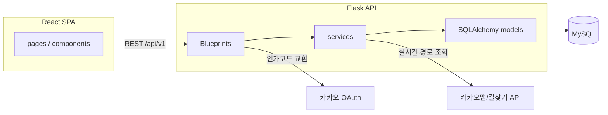
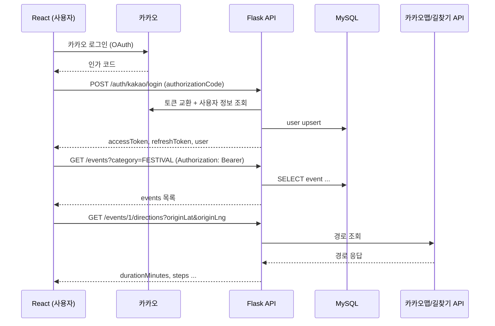

# 천안 온 — 아키텍처 명세서 (Architecture Spec)

> 이 문서는 `cheonan_on_feature_spec.md`(기능), `cheonan_on_erd_spec.md`(DB), `cheonan_on_api_spec.md`(API)를 기반으로 **Flask 백엔드**와 **React 프론트엔드**의 디렉토리/패키지 구조를 정의한다.
> 프론트엔드는 AI 코드 생성 도구로 Figma 화면("천안 온 - UI/UX 디자인" 파일)을 그대로 구현할 예정이므로, 이 문서는 실제 컴포넌트 코드가 아니라 **AI가 그대로 따라 만들 수 있는 디렉토리 구조와 화면 ID 매핑**을 정의하는 데 목적이 있다.

## 1. 개요

| 영역 | 스택 | 비고 |
|---|---|---|
| 프론트엔드 | React (SPA) | `frontend/` — Figma 화면을 AI 코드 생성으로 구현 예정 |
| 백엔드 | Python (Flask) | `backend/` — REST API 서버, Base URL `/api/v1` |
| 데이터베이스 | MySQL | `cheonan_on_erd_spec.md`의 4개 테이블 |
| 인증 | 카카오 로그인(OAuth) → 자체 JWT 발급 | `Authorization: Bearer {token}` |
| 외부 연동 | 카카오맵/카카오모빌리티(지도·길찾기), 행사 데이터 소스(TourAPI 등, 추후) | `06_길찾기`는 매 요청마다 외부 API 호출 |

프론트엔드와 백엔드는 완전히 분리된 저장소/프로세스로 두고, HTTP(JSON) API로만 통신한다.



---

## 2. Flask 백엔드 구조

```
backend/
├── app/
│   ├── __init__.py          # Flask app factory, 확장 초기화, 블루프린트 등록
│   ├── config.py            # 환경별 설정 (dev/prod, DB URI, JWT secret, 카카오 client 정보, 지도 API 키, 업로드 저장소 설정)
│   ├── extensions.py        # SQLAlchemy, Flask-JWT-Extended, CORS, Migrate 등 인스턴스
│   ├── models/               # SQLAlchemy 모델 (cheonan_on_erd_spec.md 테이블 매핑)
│   │   ├── user.py
│   │   ├── event.py
│   │   ├── bookmark.py
│   │   └── review.py
│   ├── api/                  # 블루프린트 (cheonan_on_api_spec.md 도메인 매핑)
│   │   ├── auth/               # 1. 카카오 로그인/로그아웃/토큰재발급
│   │   ├── events/             # 2. 행사 목록/상세/길찾기
│   │   ├── reviews/            # 3. 행사 리뷰, 내 리뷰, 리뷰 사진 업로드
│   │   ├── bookmarks/          # 4. 북마크
│   │   └── users/              # 5. 마이페이지(내 정보)
│   ├── services/              # 도메인 로직
│   │   ├── kakao.py               # 카카오 토큰 교환, 사용자 정보 조회
│   │   ├── directions.py          # 외부 길찾기 API 호출·응답 매핑 (06_길찾기)
│   │   └── storage.py             # 리뷰 사진 업로드 저장(로컬 디스크 또는 S3 호환 스토리지)
│   ├── schemas/               # 요청/응답 직렬화·검증 (marshmallow 또는 pydantic)
│   └── errors.py              # 공통 에러 핸들러 (cheonan_on_api_spec.md 6절 에러 포맷)
├── migrations/               # Flask-Migrate/Alembic 마이그레이션
├── tests/
├── requirements.txt
└── wsgi.py                   # 앱 진입점
```

### 2.1 블루프린트 ↔ API 라우트 대응

| 블루프린트 | 라우트 (cheonan_on_api_spec.md) |
|---|---|
| `api/auth` | `POST /auth/kakao/login`, `POST /auth/logout`, `POST /auth/token/refresh` |
| `api/events` | `GET /events`, `GET /events/{id}`, `GET /events/{id}/directions` |
| `api/reviews` | `GET/POST /events/{id}/reviews`, `GET /users/me/reviews`, `DELETE /reviews/{id}`, `POST /uploads/images` |
| `api/bookmarks` | `GET/POST /bookmarks`, `DELETE /bookmarks/{eventId}` |
| `api/users` | `GET /users/me` |

### 2.2 모델 ↔ ERD 테이블 대응

| 모델 파일 | 테이블 (cheonan_on_erd_spec.md) |
|---|---|
| `models/user.py` | `user` |
| `models/event.py` | `event` |
| `models/bookmark.py` | `bookmark` |
| `models/review.py` | `review` |

### 2.3 인증 흐름

1. 프론트가 카카오 인가 코드를 `POST /auth/kakao/login`으로 전달
2. `services/kakao.py`가 카카오 토큰 교환 + 사용자 정보 조회, `user` 테이블 upsert
3. 서비스 자체 Access/Refresh JWT 발급 (Flask-JWT-Extended)
4. 이후 인증이 필요한 API는 `Authorization: Bearer {accessToken}` 헤더 검증
5. 만료 시 `POST /auth/token/refresh`로 재발급

### 2.4 길찾기(`06_길찾기`) 처리 방식

`services/directions.py`는 매 요청마다 `originLat`/`originLng`/`mode`를 받아 외부 길찾기 API(카카오모빌리티 등)를 호출하고, 그 응답을 `cheonan_on_api_spec.md` 2.3절 포맷으로 변환해 반환한다. DB에 캐싱·저장하지 않는다 (`cheonan_on_erd_spec.md` 4절 참고).

---

## 3. React 프론트엔드 구조

```
frontend/
├── src/
│   ├── pages/                 # cheonan_on_feature_spec.md 화면 단위
│   │   ├── Home/                    # 01_홈
│   │   ├── EventList/               # 02, 02b, 02c, 02d (뷰 토글로 한 페이지 내 상태 전환)
│   │   │   ├── ListView.tsx             # 02_행사목록
│   │   │   ├── CalendarView.tsx         # 02b_행사목록_캘린더뷰
│   │   │   ├── MapView.tsx              # 02c_행사목록_지도뷰
│   │   │   └── EmptyResult.tsx          # 02d_행사목록_검색결과없음
│   │   ├── EventDetail/             # 03_행사상세, 03b_행사상세_리뷰없음 (리뷰 0건 여부로 상태 분기)
│   │   ├── Login/                   # 04_로그인
│   │   ├── MyPage/                  # 05, 05b, 05c
│   │   │   ├── Bookmarks.tsx            # 05_마이페이지 (내 북마크 탭)
│   │   │   ├── MyReviews.tsx            # 05b_마이페이지_내가쓴리뷰
│   │   │   └── BookmarksEmpty.tsx       # 05c_마이페이지_북마크없음
│   │   └── Directions/              # 06_길찾기
│   ├── components/             # Figma "Components" 페이지 기준 공통 컴포넌트
│   │   ├── Header/                  # State=LoggedIn / LoggedOut
│   │   ├── Footer/
│   │   ├── EventCard/
│   │   ├── Button/                  # Style × Size 변형
│   │   ├── FilterChip/
│   │   ├── BookmarkButton/
│   │   ├── Pagination/              # Figma 미반영, cheonan_on_feature_spec.md 02_행사목록 디자인 갭 참고
│   │   └── icons/
│   ├── api/                    # axios 인스턴스 + 도메인별 클라이언트 (cheonan_on_api_spec.md 대응)
│   │   ├── client.ts               # baseURL `/api/v1`, 인터셉터(토큰 첨부, 401 재발급)
│   │   ├── auth.ts
│   │   ├── events.ts
│   │   ├── reviews.ts
│   │   ├── bookmarks.ts
│   │   └── users.ts
│   ├── hooks/                  # 커스텀 훅 (북마크 토글, 인증 상태, 필터/정렬 상태, 현재 위치 등)
│   ├── store/                  # 전역 상태 (인증 토큰, 필터 상태)
│   ├── router/                 # 라우팅 정의
│   ├── types/                  # API 응답 타입 정의 (cheonan_on_api_spec.md 응답 스키마 대응)
│   └── App.tsx
├── public/
└── package.json
```

### 3.1 페이지 ↔ 화면 ID 대응

| 페이지 | 화면 ID (cheonan_on_feature_spec.md) |
|---|---|
| `pages/Home` | 01_홈 |
| `pages/EventList/ListView` | 02_행사목록 |
| `pages/EventList/CalendarView` | 02b_행사목록_캘린더뷰 |
| `pages/EventList/MapView` | 02c_행사목록_지도뷰 |
| `pages/EventList/EmptyResult` | 02d_행사목록_검색결과없음 |
| `pages/EventDetail` | 03_행사상세, 03b_행사상세_리뷰없음 |
| `pages/Login` | 04_로그인 |
| `pages/MyPage/Bookmarks` | 05_마이페이지 |
| `pages/MyPage/MyReviews` | 05b_마이페이지_내가쓴리뷰 |
| `pages/MyPage/BookmarksEmpty` | 05c_마이페이지_북마크없음 |
| `pages/Directions` | 06_길찾기 |

> 이 표는 Figma 프레임과 1:1로 매핑되도록 설계했다 — AI로 화면을 구현할 때 프레임 이름과 페이지 경로를 그대로 짝지어 작업하면 된다.

### 3.2 인증/라우팅

- Access/Refresh JWT는 `store`(전역 상태) + 안전한 저장소(httpOnly 쿠키 또는 메모리+refresh 전략)에 보관
- 비로그인 상태에서 북마크·리뷰 작성·마이페이지 접근 시 `04_로그인`으로 리다이렉트하는 라우팅 가드 적용, 로그인 성공 후 원래 시도했던 화면으로 복귀
- 로그아웃 버튼은 현재 Figma에 없음(`cheonan_on_feature_spec.md` 05_마이페이지 디자인 갭 참고) — `pages/MyPage`의 프로필 영역에 로그아웃 버튼을 추가하고 `POST /auth/logout` 호출 후 `01_홈`으로 이동하도록 구현
- `EventList`의 리스트/캘린더/지도 뷰, `EventDetail`의 리뷰 있음/없음 상태는 별도 라우트가 아니라 **같은 페이지 내부의 컴포넌트/상태 전환**으로 구현 (뷰 토글 값, `reviewCount === 0` 여부로 분기)

### 3.3 범위 제한

`cheonan_on_feature_spec.md` 8절의 추후 고도화 항목(알림 설정, 리뷰 좋아요·신고, 커뮤니티, 관리자 페이지)은 이번 프론트 구조에도 포함하지 않는다.

---

## 4. 백엔드-프론트 연동 요약



- 에러 응답은 공통 포맷(`{ error: { code, message } }`)을 사용하며, 프론트 `api/client.ts` 인터셉터에서 `error.code` 기준으로 분기 처리 (예: 401 → 토큰 재발급 후 재시도, `ROUTE_NOT_FOUND` → `06_길찾기`에 경로 없음 안내)
- `06_길찾기`는 브라우저 Geolocation API로 얻은 좌표를 `originLat`/`originLng`로 매 요청마다 전달해야 하므로, 위치 권한 거부 시의 폴백 UX를 `hooks/`(예: `useGeolocation`)에서 처리
