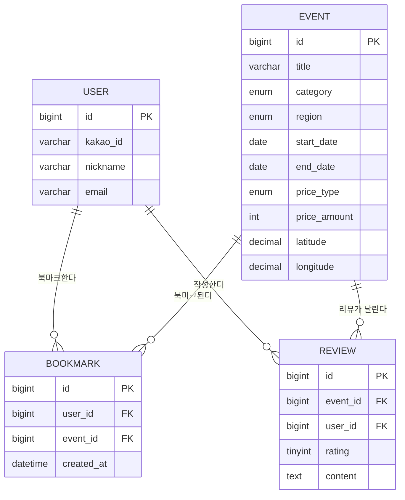

# 천안 온 — ERD 명세서 (ERD Spec)

> 대상 DB: MySQL. 모든 테이블은 `id BIGINT AUTO_INCREMENT PK`, `created_at DATETIME NOT NULL DEFAULT CURRENT_TIMESTAMP`를 기본으로 갖는다 (표에는 도메인 컬럼 위주로 표기).
> `cheonan_on_feature_spec.md`의 12개 화면이 실제로 요구하는 데이터만 반영한 최소 스키마다.

## 1. 테이블 목록

| 테이블명 | 설명 |
|---|---|
| `user` | 카카오 로그인 사용자 |
| `event` | 행사 (축제/전시/공연/체험/계절행사) |
| `bookmark` | 사용자-행사 북마크 (N:M) |
| `review` | 행사 리뷰·평점 |

## 2. 테이블 상세

### 2.1 `user`
| 컬럼 | 타입 | PK/FK | NOT NULL | 설명 |
|---|---|---|---|---|
| id | BIGINT | PK | Y | 사용자 ID |
| kakao_id | VARCHAR(64) | - | Y | 카카오 고유 ID (UNIQUE) |
| nickname | VARCHAR(50) | - | Y | 닉네임 |
| profile_image_url | VARCHAR(500) | - | N | 프로필 이미지 URL |
| email | VARCHAR(255) | - | N | 카카오 계정 이메일 |
| created_at | DATETIME | - | Y | 가입 일시 |

> 이메일/비밀번호 회원가입은 지원하지 않으므로 비밀번호 컬럼은 없다 (카카오 로그인 전용).

### 2.2 `event`
| 컬럼 | 타입 | PK/FK | NOT NULL | 설명 |
|---|---|---|---|---|
| id | BIGINT | PK | Y | 행사 ID |
| title | VARCHAR(200) | - | Y | 행사명 |
| category | ENUM('FESTIVAL','EXHIBITION','PERFORMANCE','EXPERIENCE','SEASONAL') | - | Y | 축제/전시/공연/체험/계절행사 |
| region | ENUM('DONGNAM','SEOBUK') | - | Y | 동남구/서북구 |
| start_date | DATE | - | Y | 시작일 |
| end_date | DATE | - | Y | 종료일 (당일 행사는 start_date와 동일) |
| start_time | TIME | - | N | 시작 시각 |
| end_time | TIME | - | N | 종료 시각 |
| location | VARCHAR(200) | - | Y | 장소명 (예: "천안종합운동장 일원") |
| address | VARCHAR(300) | - | N | 상세 주소 |
| latitude | DECIMAL(10,7) | - | Y | 위도 |
| longitude | DECIMAL(10,7) | - | Y | 경도 |
| price_type | ENUM('FREE','PAID') | - | Y | 무료/유료 |
| price_amount | INT | - | N | 요금(원), `price_type='FREE'`면 NULL 또는 0 |
| organizer | VARCHAR(200) | - | N | 주최 |
| contact | VARCHAR(100) | - | N | 문의처 (전화번호 등) |
| homepage_url | VARCHAR(500) | - | N | 홈페이지 링크 |
| description | TEXT | - | N | 행사 소개 본문 |
| image_url | VARCHAR(500) | - | N | 대표 이미지 URL |
| created_at | DATETIME | - | Y | 등록 일시 |

> 카테고리·지역구는 값이 각각 5종·2종으로 고정되어 있어 별도 참조 테이블 대신 ENUM 컬럼으로 둔다. 지역/카테고리 종류가 늘어나거나 운영자가 직접 관리해야 하는 시점이 오면 `category`/`region`을 참조 테이블로 정규화하는 것을 고려한다 (5절 참고).

### 2.3 `bookmark`
| 컬럼 | 타입 | PK/FK | NOT NULL | 설명 |
|---|---|---|---|---|
| id | BIGINT | PK | Y | ID |
| user_id | BIGINT | FK → user.id | Y | 사용자 |
| event_id | BIGINT | FK → event.id | Y | 행사 |
| created_at | DATETIME | - | Y | 북마크 등록 일시 |

- UNIQUE(`user_id`, `event_id`)

### 2.4 `review`
| 컬럼 | 타입 | PK/FK | NOT NULL | 설명 |
|---|---|---|---|---|
| id | BIGINT | PK | Y | 리뷰 ID |
| event_id | BIGINT | FK → event.id | Y | 대상 행사 |
| user_id | BIGINT | FK → user.id | Y | 작성자 |
| rating | TINYINT | - | Y | 별점 (1~5) |
| content | TEXT | - | Y | 리뷰 내용 |
| image_url | VARCHAR(500) | - | N | 첨부 사진 URL (선택) |
| created_at | DATETIME | - | Y | 작성 일시 |

- UNIQUE(`user_id`, `event_id`) — 행사당 사용자 1건의 리뷰만 허용

## 3. 테이블 관계 요약

- `user` **N : M** `event` (through `bookmark`) — 북마크
- `event` **1 : N** `review` — 행사 하나에 리뷰 여러 개
- `user` **1 : N** `review` — 사용자가 작성한 리뷰

## 4. `06_길찾기` 경로 데이터에 대한 설계 참고

`06_길찾기`에서 보여주는 이동수단별 소요시간·거리·단계별 경로는 **DB에 저장하지 않는다.** 출발지가 매번 사용자의 실시간 현재 위치이기 때문에(고정된 기준점이 없음) 사전 계산·캐싱이 불가능하고, API 호출 시점마다 외부 지도/경로 API(카카오모빌리티 길찾기 API 등)를 호출해 그 결과를 그대로 응답한다 (`cheonan_on_api_spec.md` 2.3절, `cheonan_on_architecture_spec.md`의 `services/directions.py` 참고).

## 5. ER 다이어그램

## 6. 추후 고도화 시 고려
- `category`/`region`을 별도 참조 테이블로 정규화 (운영자가 카테고리/지역구를 직접 추가·수정해야 하는 경우)
- 리뷰 좋아요(`review_like`), 신고(`review_report`) 테이블
- 알림 로그(`notification`) 테이블 — 북마크한 행사 D-day 알림 발송 시
- 커뮤니티 게시글/댓글(`community_post`, `community_comment`) 테이블
- 관리자용 행사 등록/수정 이력, 상태(초안/게시/종료) 컬럼
- 행사 데이터 출처 구분 컬럼 (`source`: TourAPI/공공데이터포털/수동 등록) — 공식 API 연동 시
